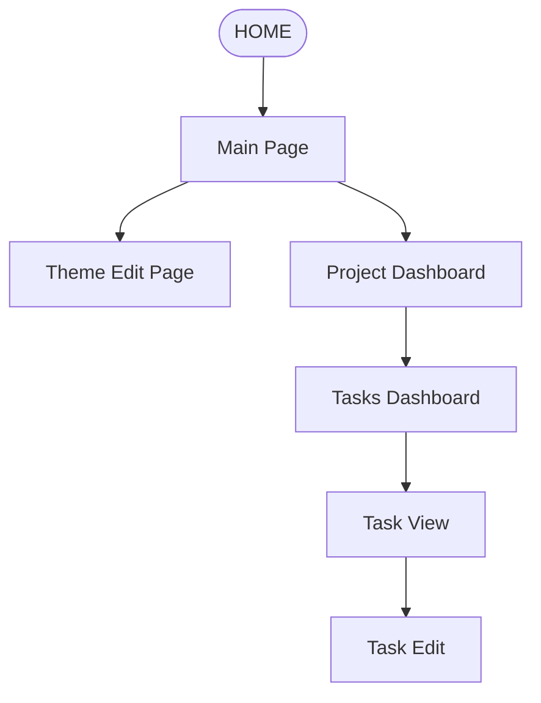
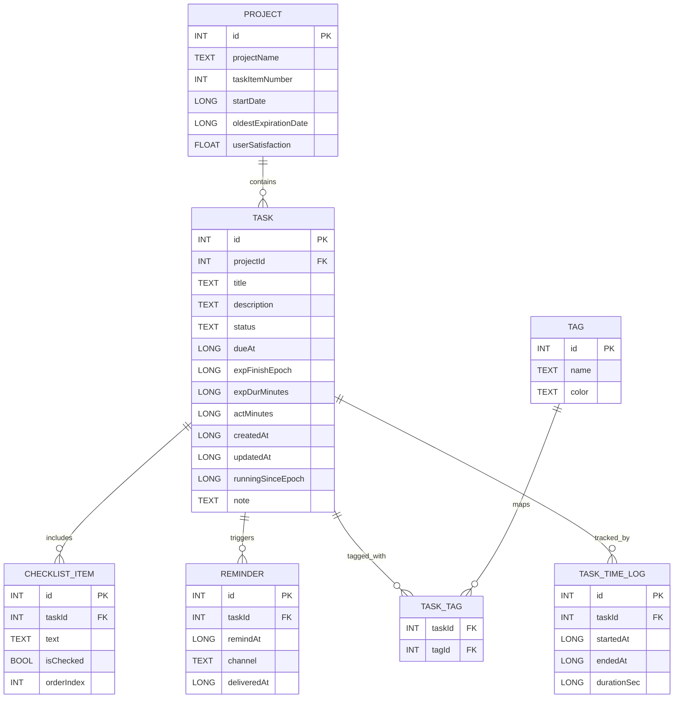

# Application Data Schema & Features (Updated)

## Project & Task Hierarchy

### Projects
Each **Project** acts as a parent container for multiple **Tasks**.

| Column | Type | Notes |
|---|---|---|
| id | INTEGER (PK) | Primary key. |
| projectName | TEXT | Unique project name. |
| taskItemNumber | INTEGER | Count of tasks in this project. Updated via trigger. |
| startDate | INTEGER (epoch ms) | Project creation/start timestamp. |
| oldestExpirationDate | INTEGER (epoch ms) | Minimum dueAt across tasks. Computed field. |
| userSatisfaction | REAL | Aggregated satisfaction metric. |

### Tasks (Child of Project)
| Column | Type | Notes |
|---|---|---|
| id | INTEGER (PK) | |
| projectId | INTEGER (FK → Project.id) | Parent link. |
| title | TEXT | |
| description | TEXT | |
| status | TEXT | Enum: `OPEN`, `IN_PROGRESS`, `DONE`, `CANCELLED`. |
| dueAt | INTEGER (epoch ms) | Due date. |
| expectedDuration | INTEGER | In minutes/hours. |
| actualDuration | INTEGER | Recorded via stopwatch. |
| createdAt | INTEGER | Timestamp. |
| updatedAt | INTEGER | Timestamp. |

---

# Task View Features

- **Stopwatch Timer** — Start/stop/reset to measure actual time worked. Writes to `actualDuration`.
- **Expected Duration Input** — unchanged (form field).
- **Due Date Input** — unchanged (calendar picker).
- **Expected Finish Date Input** — unchanged (calendar picker).
- **Markdown Note Section** — collapsible; opens in popup dialog when tapped.
- **Pie Chart** — visual ratio of `actualDuration / expectedDuration`.

# Navigation Flow

# Data Model (ER)

