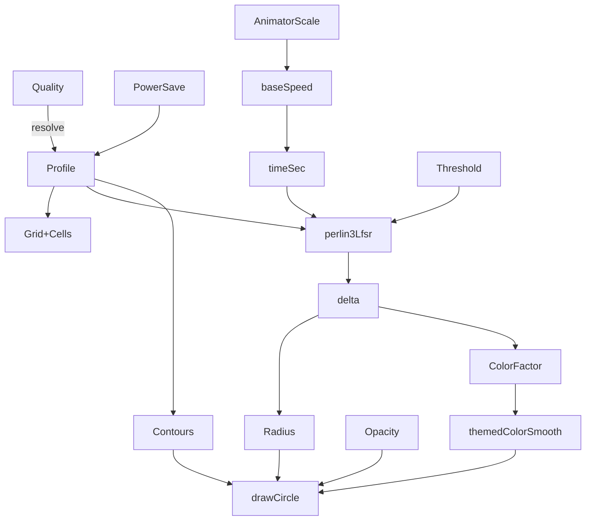
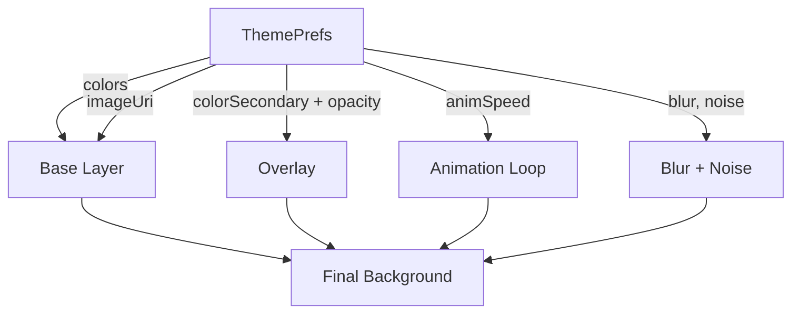
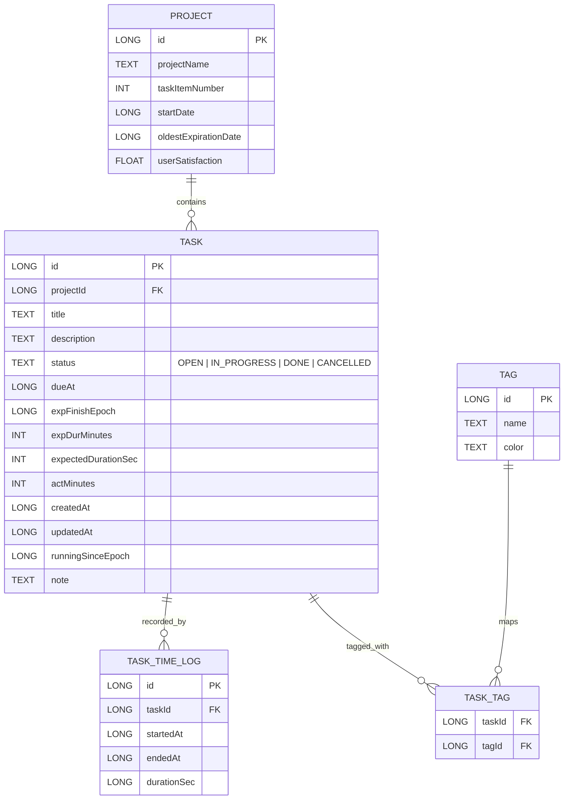

# Project–Tasks Hierarchy: Data Types

Canonical types used across persistence (Room), domain, and UI models.

```kotlin
// Project aggregates tasks
data class Project(
  val id: Long = 0L,
  val projectName: String,
  val taskItemNumber: Int = 0,
  val startDate: Long,
  val oldestExpirationDate: Long?,
  val userSatisfaction: Float?
)

enum class TaskStatus { OPEN, IN_PROGRESS, DONE, CANCELLED }

data class Task(
  val id: Long = 0L,
  val projectId: Long,
  val title: String,
  val description: String? = null,
  val status: TaskStatus = TaskStatus.OPEN,
  val dueAt: Long?,
  val expFinishEpoch: Long?,
  val expDurMinutes: Int? = null,
  val expectedDurationSec: Int? = null,
  val actMinutes: Int = 0,
  val createdAt: Long = System.currentTimeMillis(),
  val updatedAt: Long = System.currentTimeMillis(),
  val runningSinceEpoch: Long? = null,
  val note: String = ""
)

data class TaskTimeLog(
  val id: Long = 0L,
  val taskId: Long,
  val startedAt: Long,
  val endedAt: Long?,
  val durationSec: Long?
)

data class Tag(
  val id: Long = 0L,
  val name: String,
  val color: String? = null
)

data class TaskTag(
  val taskId: Long,
  val tagId: Long
)
```

---

# Theme Data Types

```kotlin
data class ThemePrefs(
  val id: Long = 0L,
  val mode: ThemeMode = ThemeMode.SYSTEM,
  val colorPrimary: String? = null,   // HEX (#RRGGBB or #AARRGGBB)
  val colorSecondary: String? = null,
  val imageUri: String? = null,       // optional background image
  val opacity: Float = 1.0f,          // 0.0..1.0
  val blur: Float = 0.0f,             // px radius (post-effect)
  val noise: Float = 0.0f,            // grain intensity 0..1
  val animSpeed: Float = 1.0f,        // 0 disables animation
  val updatedAt: Long = System.currentTimeMillis()
)

enum class ThemeMode { LIGHT, DARK, SYSTEM }

// Background animation configuration used at runtime
enum class Quality { LOW, MEDIUM, HIGH, AUTO }

data class Profile(
  val refinement: Float,      // perlin refinement factor
  val cellTargetPx: Float,    // desired cell px (0 => auto)
  val timeSpeed: Float,       // base time speed
  val contours: Boolean       // draw contour grid overlay
)

enum class PaletteTheme { AQI, BIO_NEON, TERMINAL_LOG, CUSTOM }
```

---

# Background Animation Logic

The `BackgroundAnimation` composable renders a Perlin-grid animated background. **This section mirrors the current source code** (parameters, enums, and flow).

## Composable API (source-aligned)

| Parameter                    | Type           | Default        | Notes                                                      |
| ---------------------------- | -------------- | -------------- | ---------------------------------------------------------- |
| `modifier`                   | `Modifier`     | —              | Canvas host.                                               |
| `opacity`                    | `Float`        | `1f`           | Multiplies fill alpha.                                     |
| `grainAlpha`                 | `Float`        | `0f`           | Reserved for grain overlay (not drawn in current snippet). |
| `enableAgsl`                 | `Boolean`      | `false`        | Placeholder for AGSL path.                                 |
| `quality`                    | `Quality`      | `Quality.AUTO` | Influences `Profile`.                                      |
| `threshold`                  | `Float`        | `0.0f`         | Depth cutoff; below = no circle.                           |
| `radiantUnit`                | `Dp`           | `18.dp`        | Radius unit multiplier.                                    |
| `colorUnit`                  | `Float`        | `0.9f`         | Scales color factor.                                       |
| `baseA` / `baseB` / `accent` | `Color?`       | `null`         | Fallback palette when `CUSTOM` missing.                    |
| `lfsrSeed`                   | `Int`          | `1337`         | LFSR seed.                                                 |
| `lfsrTapMask`                | `Int`          | `0x71`         | LFSR tap mask.                                             |
| `colorTheme`                 | `PaletteTheme` | `AQI`          | Palette set.                                               |
| `customPalette`              | `List<Color>?` | `null`         | Used when `PaletteTheme.CUSTOM`.                           |

### Runtime factors

* Foreground detection via `LifecycleEventObserver` pauses time accumulation when not in `ON_RESUME`.
* Power Saver (`PowerManager.isPowerSaveMode`) + **Quality** → `Profile` using `Quality.resolve(powerSave)`.
* Global Animator scale (`Settings.Global.ANIMATOR_DURATION_SCALE`) clamps animation speeds: 0 => very slow, `<0.5` => half speed.

### Profile (from `Quality.resolve`)

* **LOW**/**PowerSave** → `Profile(0.030f, 36f, 0.05f, false)`
* **MEDIUM** → `Profile(0.036f, 28f, 0.05f, false)`
* **HIGH** → `Profile(0.042f, 22f, 0.02f, true)`
* **AUTO** → `Profile(0.038f, 0f, 0.12f, true)` *(auto cell size)*

### Rendering steps (exact math)

1. Compute `baseSpeed = profile.timeSpeed` scaled by animator scale bucket.
2. Accumulate `timeSec` in a `LaunchedEffect` loop using `withFrameNanos`; clamp `dt` ≤ 50ms.
3. Derive `cell = max(8f, profile.autoCellSizePx(w, h))`, then grid `cols/rows`.
4. For each cell center `(i,j)` with time `t = (timeSec * 10f) % 1_000_000f`:

   * `depth = perlin3Lfsr(i*refinement, j*refinement, t, lfsrSeed, lfsrTapMask)`
   * `delta = depth - threshold`
   * `radius = max(0, delta * radiantUnitPx)`; skip if `≤ 0.6`
   * `colorFactor = clamp(delta * colorUnit, 0..1.2)`
   * `colorT = clamp(colorFactor / 1.2, 0..1)`
   * `color = themedColorSmooth(colorT, colorTheme, customPalette, fallbackTri)`
   * `alpha = clamp(opacity * (0.15 + min(1, colorFactor) * 0.85), 0..1)`
   * Draw circle at `(cx, cy)` with `radius`, `color.copy(alpha)`
5. Optional **contours**: grid lines every `max(16, cell*1.2)` px with stroke `max(1, cell*0.035)`.

### Palettes

* `AQI` (6-step), `BIO_NEON` (neon cyan/pink/yellow), `TERMINAL_LOG` (terminal-like grays + primaries), or **CUSTOM**.
* `themedColorSmooth` samples palettes smoothly (`lerpColor`) across stops.

## Mermaid — Animation data flow



> This exactly matches the provided `BackgroundAnimation` source, including parameter names, enums, and helper functions (`Quality.resolve`, `Profile.autoCellSizePx`, palette helpers, and LFSR-based Perlin hashing).

1. **Base Layer**: fill with `colorPrimary` or `imageUri`.
2. **Secondary Overlay**: apply `colorSecondary` with `opacity`.
3. **Animation**: if `animSpeed > 0`, run an infinite loop (`rememberInfiniteTransition`) animating gradient offset or particle flow.
4. **Blur / Noise**: draw blur shader and grain effect overlays if set.
5. **Compose Integration**: wrapped in a `Box` beneath all other composables.



---

# Page Navigation Flow

```mermaid
flowchart TD
  Home[HomeScreen] --> Main[MainScreen]
  Main --> Theme[ThemePicker]
  Main --> Proj[ProjectScreen]
  Proj --> Dash[Dashboard]
  Dash --> Task[TaskScreen]
  Task --> Edit[TaskEditScreen]

  Task -->|open| NoteModal[Notes Modal (Markdown)]
  Task --> Pie[Pie: actual/expected]
  Task --> Dates[Due & Expected Finish]
  Task --> Stopwatch[Stopwatch Start/Stop]
```

---

# Data Model — ER Diagram



---

# Entity Summaries

| Entity          | Description                                                                                                   |
| --------------- | ------------------------------------------------------------------------------------------------------------- |
| **Project**     | Container for multiple tasks; tracks metadata like start date, oldest due date, and aggregated satisfaction.  |
| **Task**        | Work item within a project; has title, description, status, scheduling fields, stopwatch tracking, and notes. |
| **TaskStatus**  | Enum: `OPEN`, `IN_PROGRESS`, `DONE`, `CANCELLED`.                                                             |
| **TaskTimeLog** | Records precise effort intervals from stopwatch sessions (start, end, duration).                              |
| **Tag**         | User-defined label with a name and optional color for categorizing tasks.                                     |
| **TaskTag**     | Join entity for many-to-many relation between tasks and tags.                                                 |
| **ThemePrefs**  | User theme settings including mode, colors, background image, opacity, blur, noise, and animation speed.      |
| **ThemeMode**   | Enum: `LIGHT`, `DARK`, `SYSTEM`.                                                                              |
