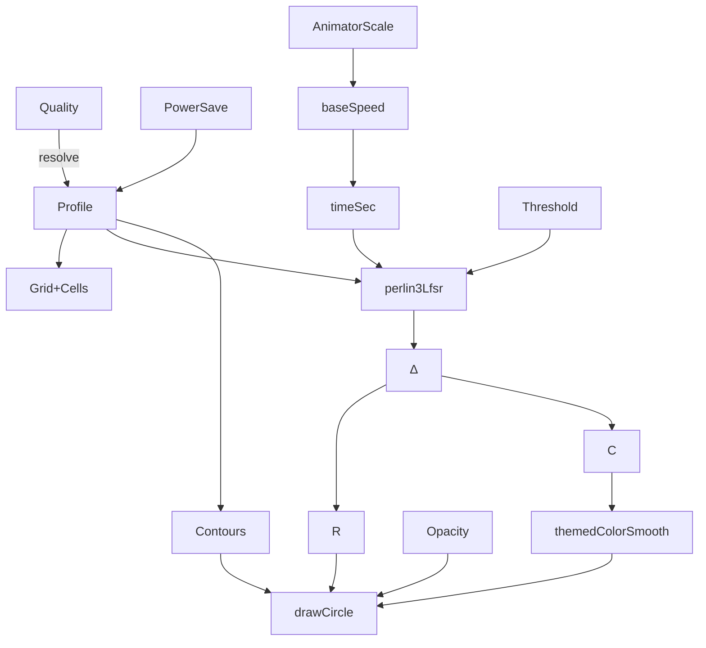
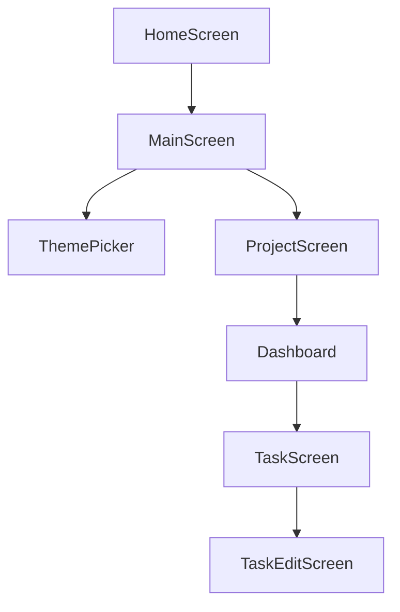
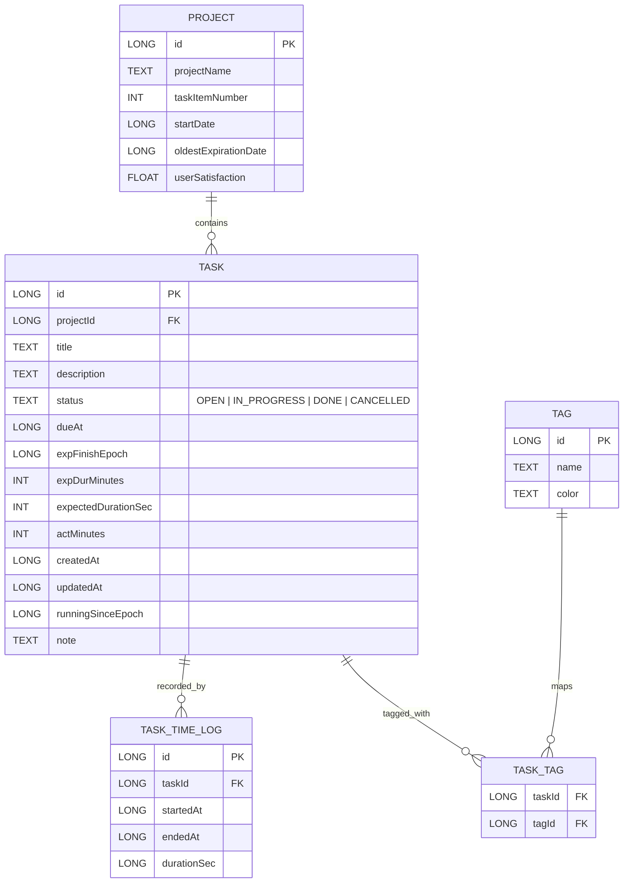

# Project–Tasks Hierarchy: Data Types

Canonical types used across persistence (Room), domain, and UI models.

```kotlin
// Project aggregates tasks
data class Project(
  val id: Long = 0L,
  val projectName: String,
  val taskItemNumber: Int = 0,
  val startDate: Long,
  val oldestExpirationDate: Long?,
  val userSatisfaction: Float?
)

enum class TaskStatus { OPEN, IN_PROGRESS, DONE, CANCELLED }

data class Task(
  val id: Long = 0L,
  val projectId: Long,
  val title: String,
  val description: String? = null,
  val status: TaskStatus = TaskStatus.OPEN,
  val dueAt: Long?,
  val expFinishEpoch: Long?,
  val expDurMinutes: Int? = null,
  val expectedDurationSec: Int? = null,
  val actMinutes: Int = 0,
  val createdAt: Long = System.currentTimeMillis(),
  val updatedAt: Long = System.currentTimeMillis(),
  val runningSinceEpoch: Long? = null,
  val note: String = ""
)

data class TaskTimeLog(
  val id: Long = 0L,
  val taskId: Long,
  val startedAt: Long,
  val endedAt: Long?,
  val durationSec: Long?
)

data class Tag(
  val id: Long = 0L,
  val name: String,
  val color: String? = null
)

data class TaskTag(
  val taskId: Long,
  val tagId: Long
)
```

---

# Theme Data Types

```kotlin
data class ThemePrefs(
  val id: Long = 0L,
  val mode: ThemeMode = ThemeMode.SYSTEM,
  val colorPrimary: String? = null,   // HEX (#RRGGBB or #AARRGGBB)
  val colorSecondary: String? = null,
  val imageUri: String? = null,       // optional background image
  val opacity: Float = 1.0f,          // 0.0..1.0
  val blur: Float = 0.0f,             // px radius (post-effect)
  val noise: Float = 0.0f,            // grain intensity 0..1
  val animSpeed: Float = 1.0f,        // 0 disables animation
  val updatedAt: Long = System.currentTimeMillis()
)

enum class ThemeMode { LIGHT, DARK, SYSTEM }

// Background animation configuration used at runtime
enum class Quality { LOW, MEDIUM, HIGH, AUTO }

data class Profile(
  val refinement: Float,      // perlin refinement factor
  val cellTargetPx: Float,    // desired cell px (0 => auto)
  val timeSpeed: Float,       // base time speed
  val contours: Boolean       // draw contour grid overlay
)

enum class PaletteTheme { AQI, BIO_NEON, TERMINAL_LOG, CUSTOM }
```

---

# Background Animation Logic

The `BackgroundAnimation` composable renders a Perlin-grid animated background. **This section mirrors the current source code** (parameters, enums, and flow).

## Composable API (source-aligned)

(see parameter table above)

### Rendering steps (exact math)

1. Compute baseSpeed.
2. Accumulate timeSec.
3. Derive grid.
4. For each cell, compute depth, delta, radius, colorFactor, color, alpha.
5. Draw circle or contours.

### Simple Math Formulation

Let `(i, j)` index grid cells, `t` the animation time, and `P(x,y,z)` the Perlin‑LFSR noise function.

* Depth:   dᵢⱼ(t) = P(i·r, j·r, t)
* Delta:   Δᵢⱼ(t) = dᵢⱼ(t) − θ
* Radius:  Rᵢⱼ(t) = max(0, Δᵢⱼ(t) · U)
* Color:   Cᵢⱼ(t) = clamp(Δᵢⱼ(t) · u, 0, 1.2)
* Norm:    Tᵢⱼ = Cᵢⱼ(t)/1.2
* Alpha:   αᵢⱼ(t) = clamp(opacity × (0.15 + min(1,Cᵢⱼ(t)) × 0.85), 0, 1)

Circle drawn if Rᵢⱼ(t) > 0.6.



# Page Navigation Flow



```mermaid
flowchart TD
  %% Task internals kept separate to avoid line-join parse errors
  Task[TaskScreen]
  Task --> NoteModal[Notes Modal (Markdown)]
  Task --> Pie[Pie: actual/expected]
  Task --> Dates[Due & Expected Finish]
  Task --> Stopwatch[Stopwatch Start/Stop]
```

```mermaid
flowchart TD
  Home[HomeScreen] --> Main[MainScreen]
  Main --> Theme[ThemePicker]
  Main --> Proj[ProjectScreen]
  Proj --> Dash[Dashboard]
  Dash --> Task[TaskScreen]
  Task --> Edit[TaskEditScreen]

  Task -->|open| NoteModal[Notes Modal (Markdown)]
  Task --> Pie[Pie: actual/expected]
  Task --> Dates[Due & Expected Finish]
  Task --> Stopwatch[Stopwatch Start/Stop]
```

---

# Data Model — ER Diagram



---

# Entity Data Types (Detailed)

### Project

| Field                | Type   | Unit / Domain | Notes                      |
| -------------------- | ------ | ------------- | -------------------------- |
| id                   | Long   | PK            | Primary key                |
| projectName          | String | —             | Unique project name        |
| taskItemNumber       | Int    | count         | Maintained by repo/trigger |
| startDate            | Long   | epoch ms      | Creation timestamp         |
| oldestExpirationDate | Long?  | epoch ms      | Earliest Task.dueAt        |
| userSatisfaction     | Float? | 0.0–1.0       | DONE / (IN\_PROGRESS+DONE) |

### Task

| Field               | Type       | Unit / Domain | Notes                               |
| ------------------- | ---------- | ------------- | ----------------------------------- |
| id                  | Long       | PK            | Task id                             |
| projectId           | Long       | FK            | References Project.id               |
| title               | String     | —             | Title                               |
| description         | String?    | —             | Optional details                    |
| status              | TaskStatus | enum          | OPEN, IN\_PROGRESS, DONE, CANCELLED |
| dueAt               | Long?      | epoch ms      | Due date                            |
| expFinishEpoch      | Long?      | epoch ms      | Expected finish time                |
| expDurMinutes       | Int?       | minutes       | Expected duration                   |
| expectedDurationSec | Int?       | seconds       | Expected duration                   |
| actMinutes          | Int        | minutes       | Legacy field                        |
| createdAt           | Long       | epoch ms      | Creation time                       |
| updatedAt           | Long       | epoch ms      | Update time                         |
| runningSinceEpoch   | Long?      | epoch ms      | Stopwatch start                     |
| note                | String     | markdown      | Notes                               |

### TaskStatus

| Value        | Alias     |
| ------------ | --------- |
| OPEN         | New task  |
| IN\_PROGRESS | Active    |
| DONE         | Completed |
| CANCELLED    | Aborted   |

### TaskTimeLog

| Field       | Type  | Unit     | Notes                    |
| ----------- | ----- | -------- | ------------------------ |
| id          | Long  | PK       | Log id                   |
| taskId      | Long  | FK       | Task reference           |
| startedAt   | Long  | epoch ms | Start timestamp          |
| endedAt     | Long? | epoch ms | End timestamp            |
| durationSec | Long? | seconds  | Duration = ended-started |

### Tag

| Field | Type    | Notes          |
| ----- | ------- | -------------- |
| id    | Long    | PK             |
| name  | String  | Tag label      |
| color | String? | HEX color code |

### TaskTag

| Field  | Type | Notes      |
| ------ | ---- | ---------- |
| taskId | Long | FK Task.id |
| tagId  | Long | FK Tag.id  |

### ThemePrefs

| Field          | Type      | Unit / Domain | Notes                     |
| -------------- | --------- | ------------- | ------------------------- |
| id             | Long      | PK            | Pref id                   |
| mode           | ThemeMode | enum          | LIGHT, DARK, SYSTEM       |
| colorPrimary   | String?   | HEX           | Base color                |
| colorSecondary | String?   | HEX           | Overlay color             |
| imageUri       | String?   | URI           | Optional background image |
| opacity        | Float     | 0.0–1.0       | Alpha multiplier          |
| blur           | Float     | px            | Blur radius               |
| noise          | Float     | factor        | Noise intensity           |
| animSpeed      | Float     | multiplier    | 0 disables animation      |
| updatedAt      | Long      | epoch ms      | Last update               |

### ThemeMode

| Value  | Notes         |
| ------ | ------------- |
| LIGHT  | Light theme   |
| DARK   | Dark theme    |
| SYSTEM | Follow system |

### Profile (BackgroundAnimation)

| Field        | Type    | Unit / Domain | Notes                      |
| ------------ | ------- | ------------- | -------------------------- |
| refinement   | Float   | factor        | Perlin refinement          |
| cellTargetPx | Float   | px            | Desired cell size (0=auto) |
| timeSpeed    | Float   | multiplier    | Base time speed            |
| contours     | Boolean | flag          | Draw contour grid          |

### Quality

| Value  | Notes                                 |
| ------ | ------------------------------------- |
| LOW    | Lower refinement, slower, no contours |
| MEDIUM | Medium refinement                     |
| HIGH   | High refinement, contours on          |
| AUTO   | Auto cell sizing, faster              |

### PaletteTheme

| Value         | Notes                     |
| ------------- | ------------------------- |
| AQI           | Air Quality Index palette |
| BIO\_NEON     | Neon bio colors           |
| TERMINAL\_LOG | Terminal‑like palette     |
| CUSTOM        | Provided custom palette   |
